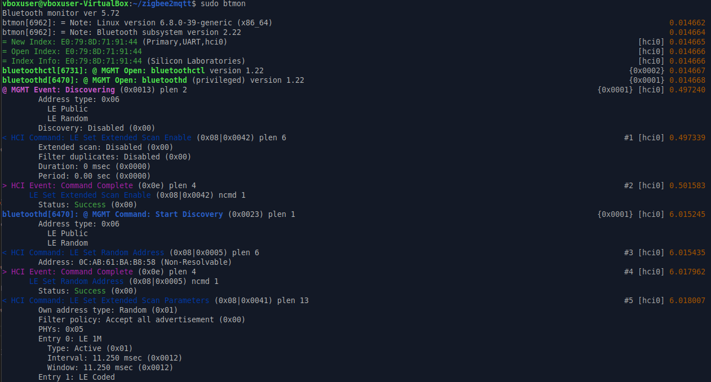

# silabs-multiprotocol-builder

> [!TIP]
> Silabs will be releasing binaries, same as this project intended, with future releases. _Archiving this for reference._

Builder for Silabs multiprotocol (Zigbee, OpenThread, Bluetooth Low Energy) components.

Uses Silicon Labs Simplicity SDK and Silicon Labs Configurator (slc) to build binaries and configurations files for supported architectures (arm32, arm64, x86_64). It mimics the official Silicon Labs Multiprotocol Docker container to be able to use the components outside of containers.

The following installation steps have been tested (unless otherwise noted) on Ubuntu 24.04 x64 (VirtualBox) with a Sonoff Dongle-E with [this firmware](https://github.com/Nerivec/silabs-firmware-builder/releases/download/v2024.6.1/sonoff_zbdonglee_rcp-uart-802154-blehci-sw_460800_2024.6.1.gbl).

> [!TIP]
> The release archives contain the `*.sh` scripts in this repository at the time of build. If using the latest release, check for newer versions of the scripts here and replace them as needed.

## Pre-setup

This step extracts the previously downloaded archive in its own folder and runs the necessary local adjustments to the newly extracted files, including possible customization.

```bash
tar xf silabs-multiprotocol-components-ARCH.tar.xz --one-top-level
cd silabs-multiprotocol-components-ARCH
sudo chmod +x ./pre-setup.sh
sudo ./pre-setup.sh
```

> [!IMPORTANT]
> Replace `ARCH` with the arch of the downloaded archive.

### Parameters

- `--device-path DEVICE_PATH`
  - The path to your physical adapter.
  - Default: `/dev/ttyACM0`.
- `--baudrate BAUDRATE`
  - The baudrate of your RCP firmware.
  - Default: `460800`.
- `--hardware-flow HARDWARE_FLOW`
  - The flow control of your RCP firmware (`sw` or `rtscts=false` should set this to `false`).
  - Default: `true`.
- `--disable-encryption DISABLE_ENCRYPTION`
  - See CPCd configuration below.
  - Default: `true`.
- `--disable-conflict-services DISABLE_CONFLICT_SERVICES`
  - Automatically disables conflicting services on your machine when set to `true`. Note: This is false by default as that may alter your current machine's state in an undesirable way. Check `script/_disable_services` for details on what may be conflicting if you wish to do it manually.
  - Default: `false`.
- `--zigbeed-iid ZIGBEED_IID`
  - The zigbeed process interface id (iid) which is used to differentiate between multiple networks using the same RCP. The iid must be set to a value between 1 and 3 and must be unique for each host process using the multi-PAN 802.15.4 RCP.
  - Default: `1`.
- `--otbr-iid OTBR_IID`
  - Same as above, for OTBR process.
  - Default: `2`.

#### Example

This is the default if no parameter given:

```bash
sudo ./pre-setup.sh --device-path /dev/ttyACM0 --baudrate 460800 --hardware-flow true --disable-encryption true --disable-conflict-services false --zigbeed-iid 1 --otbr-iid 2
```

### Installing an RCP firmware on your adapter.

These components currently require an RCP firmware version 2024.6.1. You can find some experimental builds here: https://github.com/Nerivec/silabs-firmware-builder/releases/tag/v2024.6.1

> `rcp-uart-802154-blehci` => with BLE support.

> `rcp-uart-802154` => without BLE support (you won't be able to use the BLE components).

## Install

This step installs the requested components and sets up any startup requirements.

```bash
sudo chmod +x ./install.sh
sudo ./install.sh
```

### Parameters

By default (without parameters), the script only installs cpcd (required for all others), use the parameters below to install the components you want.

- `--zigbeed`
  - Install zigbeed components.
- `--otbr`
  - Install otbr components.
- `--ot-cli`
  - Install ot-cli components.
- `--ble`
  - Install ble components.
- `--skip-cpcd`
  - Skip installation of cpcd components (useful if you want to launch the script in multiple steps to install components one at a time).
- `--all`
  - Takes precedence over `--skip-cpcd` if supplied after it, doesn't if before it.
- `--infra-if-name INFRA_IF_NAME`
  - Interface name (for OTBR), usually `eth0` or `enp0s3`.
  - Default: return value of `ip -o -4 route show to default | awk '{print $5}'`.

> [!IMPORTANT]
> The `install.sh` script should take care of detecting already installed components and skip unnecessary/undesired steps. You may need to adjust it if you want to customize the behavior.

> [!TIP]
> Restarting your machine after installing the components of your choice (below) should allow enabled services to start in the proper order automatically.

## CPCd

Base communication protocol for RCP support.

### Configuration

Location: `/usr/local/etc/cpcd.conf`

> [!NOTE]
> Setting `disable_encryption` to false requires a firmware built with encryption enabled too.

## zigbeed

Add ZigBee support.

</img>
</img>

### Configuration

Location: `/usr/local/etc/zigbeed.conf`

> [!NOTE]
> Adjust `ezsp-interface` if you modify the `socat` configuration below.

### Socat Configuration

Location: `/etc/systemd/system/zigbeed-socat.service`

> [!TIP]
> To connect to zigbeed from your ZigBee application, use the path configured in that file. Default is: `/dev/ttyZigbeeNCP`.

#### TCP

> [!WARNING]
> Untested

To use TCP instead, you can change the default socat command to something like this:
```conf
ExecStart=/usr/bin/socat -v tcp-l:9627,reuseaddr,fork pty,link=/tmp/ttyZigbeeNCP,raw
```

Then you can use `127.0.0.1:9627` in your ZigBee application (in whatever IP/port format required). _Check other socat tutorials to configure the TCP part as needed._

## OTBR

> [!WARNING]
> OTBR setup is very intricate, and might require manual editing of the scripts used to install all the requirements if your setup varies slightly. Beware, it also modifies several parts of the system to allow it to work (networking & co).

Add OpenThread support.

</img>
</img>

### Start utilities

See https://openthread.io/reference/cli/commands and https://openthread.io/guides/border-router/tools for more details.

#### ot-ctl

#### ot-cli

```bash
sudo /usr/local/bin/ot-cli 'spinel+cpc://cpcd_0?iid=2&iid-list=0'
```

> [!TIP]
> Check the `--otbr-iid` saved in `pre-setup-run.conf` from when you ran `pre-setup.sh` (above command uses default).

#### ot-fct

See [README.md](https://github.com/SiliconLabs/simplicity_sdk/blob/sisdk-2024.6/util/third_party/openthread/tools/ot-fct/README.md) for more details.

#### pskc

#### steering-data

## BLE

Add Bluetooth Low Energy support.

</img>

### Start utilities

Bluetooth CLI utility:
```bash
sudo bluetoothctl
```

View traffic:
```bash
sudo btmon
```

## Troubleshooting

Use `journalctl` to get more information if a service is misbehaving or just to check the logs:

```bash
sudo journalctl -fexu cpcd
sudo journalctl -fexu zigbeed-socat
sudo journalctl -fexu zigbeed
sudo journalctl -fexu otbr-agent
sudo journalctl -fexu otbr-web
sudo journalctl -fexu cpc-hci-bridge
sudo journalctl -fexu hciattach
sudo journalctl -fexu bluetooth
```

> [!TIP]
> If you get issues with some services that have not started after boot, see if something takes too long and prevents others from starting, _like the serial path becoming available_ (might need to adjust `sleep` times in systemd services or use similar mechanisms).
